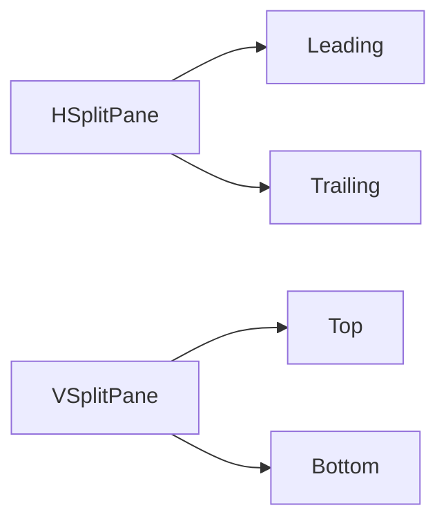

# mac-component

mac-component is a small SwiftUI package for reusable macOS interface components.

## Components

| Component | Purpose |
|---|---|
| `HSplitPane` | A leading/trailing split pane backed by `NSSplitView`. |
| `VSplitPane` | A top/bottom split pane backed by `NSSplitView`. |
| `CollapsibleView` | A main view with a collapsible bottom panel. |

## Requirements

- macOS 15.0+
- Swift 6.2+

## Installation

```swift
dependencies: [
    .package(url: "https://github.com/1amageek/mac-component.git", branch: "main")
]
```

```swift
.target(
    name: "YourApp",
    dependencies: [
        .product(name: "MacComponent", package: "mac-component")
    ]
)
```

## Split Panes

`HSplitPane` and `VSplitPane` use SwiftUI-style modifiers for pane limits. There are no public configuration objects.



The split divider is the standard AppKit `.thin` divider. The drag strip modifiers only expand the effective drag area; they do not change the visible divider color or thickness.

### HSplitPane

```swift
import MacComponent
import SwiftUI

HSplitPane {
    PrimaryView()
    DetailsView()
}
.leadingPaneWidth(minimum: 320)
.leadingPaneWidth(maximum: 640)
.trailingPaneWidth(minimum: 220)
.trailingPaneWidth(maximum: 360)
.dividerDragStrip(width: 10)
```

`HSplitPane` preserves the trailing pane size while the leading pane resizes freely.

| Modifier | Default | Meaning |
|---|---:|---|
| `leadingPaneWidth(minimum:)` | `200` | Minimum width for the leading pane. |
| `leadingPaneWidth(maximum:)` | No maximum | Maximum width for the leading pane. |
| `trailingPaneWidth(minimum:)` | `80` | Minimum width for the trailing pane. |
| `trailingPaneWidth(maximum:)` | No maximum | Maximum width for the trailing pane. |
| `dividerDragStrip(width:)` | `8` | Extra horizontal hit area for dragging the divider. |

### VSplitPane

```swift
import MacComponent
import SwiftUI

VSplitPane {
    EditorView()
    OutputView()
}
.topPaneHeight(minimum: 240)
.topPaneHeight(maximum: 520)
.bottomPaneHeight(minimum: 120)
.bottomPaneHeight(maximum: 260)
.dividerDragStrip(height: 10)
```

`VSplitPane` preserves the bottom pane size while the top pane resizes freely.

| Modifier | Default | Meaning |
|---|---:|---|
| `topPaneHeight(minimum:)` | `200` | Minimum height for the top pane. |
| `topPaneHeight(maximum:)` | No maximum | Maximum height for the top pane. |
| `bottomPaneHeight(minimum:)` | `80` | Minimum height for the bottom pane. |
| `bottomPaneHeight(maximum:)` | No maximum | Maximum height for the bottom pane. |
| `dividerDragStrip(height:)` | `8` | Extra vertical hit area for dragging the divider. |

## CollapsibleView

`CollapsibleView` uses `VSplitPane` while expanded. When collapsed, it keeps only the header visible below the main view.

```swift
CollapsibleView(isExpanded: $isExpanded) {
    CanvasView()
} content: {
    LogPanelView()
} header: {
    Label("Logs", systemImage: "terminal")
}
.topPaneHeight(minimum: 240)
.bottomPaneHeight(minimum: 120)
.collapsibleHeaderHeight(36)
```

The header remains visible when the bottom panel is collapsed.

| Modifier | Default | Meaning |
|---|---:|---|
| `collapsibleHeaderHeight(_:)` | `36` | Header bar height. |
| `collapsibleHeaderHorizontalPadding(_:)` | `10` | Horizontal padding inside the header. |
| `collapsibleToggleButton(systemImage:)` | `rectangle.bottomthird.inset.filled` | Toggle button symbol. |
| `collapsibleToggleHelp(expanded:collapsed:)` | `Hide Panel` / `Show Panel` | Toggle button help text. |

`CollapsibleView` also accepts the `VSplitPane` modifiers because those values flow through the environment.

## Inspector

The trailing pane of `HSplitPane` is just another split-pane child. It is not a SwiftUI inspector.

Use SwiftUI's `inspector(isPresented:content:)` separately when an inspector column is needed:

```swift
HSplitPane {
    WorkspaceView()
    DetailsView()
}
.inspector(isPresented: $showsInspector) {
    InspectorView()
        .inspectorColumnWidth(min: 240, ideal: 280, max: 360)
}
```

## Previews

The package includes previews for the split panes, collapsible panel, and sidebar compositions. Split-pane previews include zero-size pane cases so layout behavior can be checked when one side has no visible content.
